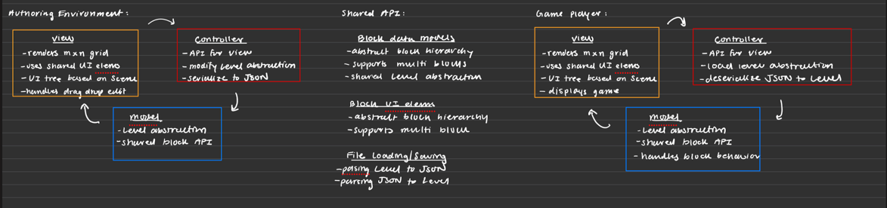

# OOGASalad Design Plan

### Arnav Nayak, Philip Lee, Divyansh Jain, Jonathan Esponda, Joseph Ogunbadewa, Yasha Doddabele, Nikita Daga

### Baba is Us

## Introduction

- We will have two programs: Authoring Environment and Game Player
- Each application will be setup with a model-view controller architecture
- The Authoring environment will be responsible for creating a variation of a Baba is You game (JSON
  file)
- The Game player will be responsible for reading and playing a variation of a Baba is You game (
  JSON file)
- These two programs also have shared APIs and classes

### Shared

* Shared between Authoring Environment and Game Player
* Scene, SceneSwitcher
* BlockView
    * ObjectView (Baba, Wall, Rock, Empty, etc)
    * PropertyView (You, Push, Win)
    * RelationshipView (Is)
* JSON File parser

### Authoring Environment

* View
    * Scenes
    * Modify backend with drag-drop
    * This customizes what the user wants to be on the level upon initialization
* Controller
    * APIs to record down what was clicked by the player and selected.
    * Used to build the JSON file
    * addBlock(int m, int n, BlockEnum blockType);
    * saveLevel();
    * ViewController, MainController
* Model
    * Level
        * 2D Grid[m][n] (make abstract, iterator)
        * Metadata (Name, Description)
        * Block Interface
            * Baba
            * Empty
            * Wall
            * Rock
            * Relationship (Is)
            * Property (You, Push, Stop, Win)
        * Basic validation (At least one relationship: a block player, a property, a win block)
    * Turn level into JSON

### Game Player

* View
    * Scene
    * Use shared API
    * Observer design pattern to listen to model
* Controller
    * ViewController, MainController
* Model
    * Blocks (abstract class featuring subclasses Baba, Wall, Rock, Empty, etc)
    * Components pattern
        * Component interface
        * Controllable
        * Movable/Pushable
        * Winnable
    * Factory pattern
        * Block factory (uses reflections to create blocks)
    * Interpreter (parser to detect the rules/block sentences)
    * Handlers
        * MovementHandler
        * Provides APIs to move blocks
    * Utility
        * Holds records, other utilities

## Configuration File Format

```json
{
  "levelName": "The Dungeon of Doom",
  "gridSize": {
    "rows": 5,
    "columns": 10
  },
  "grid": {
    "cells": [
      [
        "Empty",
        "Empty",
        "Empty",
        "Empty",
        "Wall",
        "Empty",
        "Empty",
        "Baba",
        "Is",
        "Win"
      ],
      [
        "Empty",
        "Empty",
        "Empty",
        "Empty",
        "Wall",
        "Empty",
        "Empty",
        "Empty",
        "Empty",
        "Empty"
      ],
      [
        "Empty",
        "Empty",
        "BabaEmpty",
        "Empty",
        "Wall",
        "Empty",
        "Flag",
        "Empty",
        "Empty",
        "Empty"
      ],
      [
        "Empty",
        "Empty",
        "Empty",
        "Empty",
        "Rock",
        "Empty",
        "Empty",
        "Empty",
        "Empty",
        "Empty"
      ],
      [
        "Empty",
        "Empty",
        "Empty",
        "Empty",
        "Wall",
        "Empty",
        "Empty",
        "Rock",
        "Is",
        "Win"
      ]
    ],
    "metadata": {
      "difficulty": "Easy",
      "author": "GameDev123",
      "language": "English",
      "special-mode": "Normal"
    },
    "graphic": {
      "Baba": "images/baba.png",
      "Wall": "images/wall.png",
      "Rock": "images/rock.png"
    }
  }
```

## Design Overview



* We plan to use an MVC architecture for both the authoring environment and game player.
* We also plan to create a shared Block API. The Block API will offer two types of block
  abstractions:
    * BlockViews. These will be UI implementations of each block (will follow a relational
      hierarchy)
    * Blocks. These will be the data model implementation of each block (will follow the same
      relational hierarchy)
* The Authoring Environment will be set up with MVC:
    * The model will have a level abstraction. This will consist of a grid of Blocks (from Block
      API). State change will notify the View of an update.
    * The controller will act as an API between the view and the model. It will handle when the view
      edits a specific Block and when the view wants to serialize to JSON. These methods would
      modify state maintained (e.g. Level, Blocks), which can trigger a state change.
    * The view is what the user interacts with. It will be a mxn grid of BlockViews (from Block API)
      and a drag and drop edit will trigger a controller update.
* The Game Player will be set up with MVC:
    * The model will have a level abstraction. This will consist of a grid of Blocks (from Block
      API). State change will notify the View of an update.
    * The controller will act as an API between the view and the model. It will handle events
      notified to it from the View. These methods would modify state maintained (e.g. Level, Block),
      which can trigger a state change.
    * The view is what the user interacts with. It will be a mxn grid of BlockViews (from Block API)
      and keyboard input will trigger a controller update.

## Design Details

* Follow SOLID principles
* Use design patterns

## Design Considerations

* We plan to create a shared Block API that will offer UI views for blocks and data models for
  blocks for use for both applications.
* We plan to use the following design patterns:
    * MVC architecture
    * Observer design pattern
    * Factory design pattern
    * Strategy design pattern
    * Composite design pattern
    * Visitor design pattern

## Test Plan

* Practice some TDD
* Aim to have a 70% internal testing throughout the milestones
* Increase testing near end of project

## Team Responsibilities

* Team Member #1: Arnav Nayak
    * Model for Game Player and Authoring Environment

* Team Member #2: Philip Lee
    * Model for Game Player

* Team Member #3: Joseph Ogunbadewa
    * Model for Game Player

* Team Member #4: Divyansh Jain
    * Model for Authoring Environment

* Team Member #5: Jonathan Esponda
    * View for Game Player and Authoring Environment

* Team Member #6: Yasha Doddabele
    * View for Game Player

* Team Member #7: Nikita Daga
    * View for Authoring Environment

